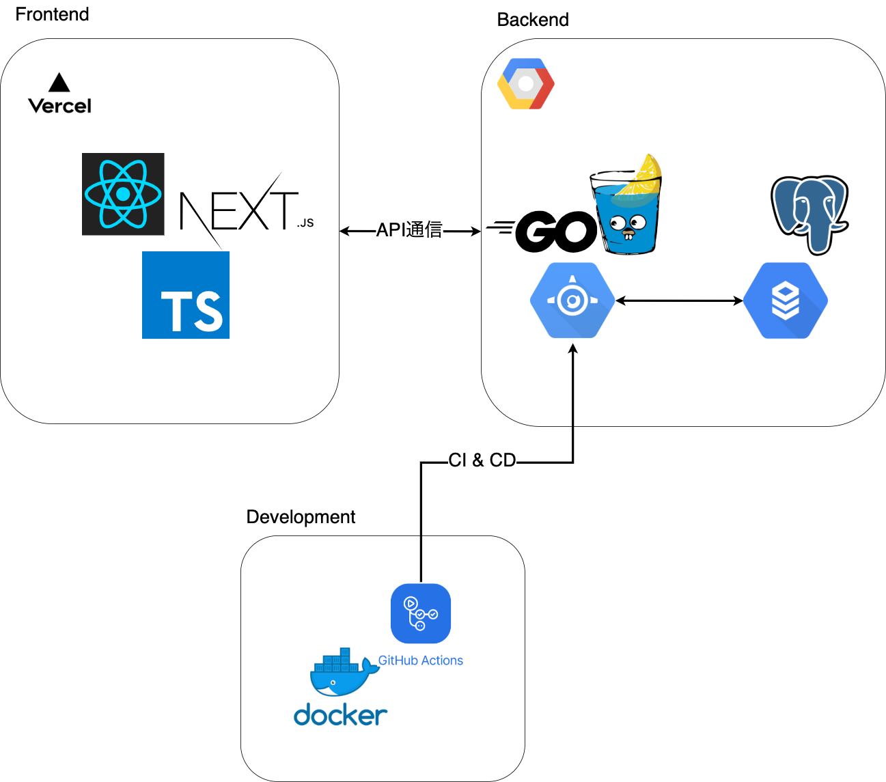

# QuoteMemo

## 概要

QuoteMemoは書籍の引用を管理・シェアできるWebサービスです。

## デモページ
[https://quote-memo-client.vercel.app](https://quote-memo-client.vercel.app)

※サーバー停止中

## 使用技術

バックエンド
  - Go v1.16
  - Gin v1.7.1
  - Gorm v1.21.9
  - PostgreSQL v13

フロントエンド
  - TypeScript v4.2.3
  - React v17.0.2
  - Next.js v10.2.2
  - Chakra UI (@chakra-ui/react v1.4.2)

認証
  - Firebase Authentication

開発環境
  - Docker/docker-compose

 CIツール
  - GitHub Actions

インフラ
  - Vercel
  - GCP(App Engine/Cloud SQL)

## システム構成図

## ER図

## 機能一覧
- Twitterログイン
- 外部APIを利用した書籍検索
- 引用の作成・更新・削除
- 公開設定
- タグ付け
- 複数のタグを指定して検索する機能
- 書籍に関連する引用一覧を表示する機能
- 他のユーザーが公開した引用一覧を表示する機能
- 他のユーザーが公開した引用をお気に入りに追加する機能
- 無限スクロール
- ダークモード
- 引用データをJSON形式でエクスポートする機能
- 退会処理

## 作成動機
- 本の中で気に入った言葉をメモする習慣があり、書籍情報やタグと紐付けて保存できれば横断的に検索ができて便利だと思ったため、本サービスを作成しました。
- 当初は個人で利用する目的を想定していましたが、他のユーザーと引用をシェアすることで新しい作品と出会うことができるのではないかと考え、公開された他のユーザーの引用を閲覧できる機能を追加しました。

## 技術詳細

#### バックエンド
- 言語はGoを使用しています。Node.jsと比較して、純正のフォーマッタによる自動補完が優秀である点、エラーを返り値として返すため機械的にエラー処理を実装できる点に惹かれて採用を決定しました。
- フレームワークはGin、ORMはGormを使用しています。
- 設計はレイヤーを意識して、コントローラ層からビジネスロジックをサービス層に分離しました。
- コントローラとサービスにはNewメソッドを持たせ、トップレベルで実体を注入しています。
- コントローラ層では適切なエラーハンドリングを行うことを意識しました。
- コントローラ層では入力値のバリデーションを行なっています。
- サービス層のメソッドについては全てテストを書きました。
- 複数のタグを指定して引用を検索する処理は、サブクエリを活用して2段階でテーブルを結合させることで実装しました。

#### フロントエンド
- ReactとNext.jsで構築しました。言語はTypeScriptを使用しています。
- CSSフレームワークは、他と比較して意見性の弱いChakraUIを採用しました。
- 全体的なデザインは[zenn.dev](https://zenn.dev/)を参考にしました。
- 他のユーザーや書籍と紐づけられた引用を表示するページは、即座に変更を反映する必要がないため、SSGを利用してビルド時にデータを取得しています。
- ビューとロジックの分離を意識し、ビジネスロジックをカスタムフックにカプセル化しました。
- `axios`のインターセプターを利用してXHRを行う際の共通処理を一箇所にまとめました。
- フォームには`react-hook-form`、バリデーションには`yup`を採用し、バリデーションエラーは内容に応じてエラーメッセージを変更するようにしました。
- カスタムフック内の`useEffect`で非同期処理を実行してデータを取得する際は、カスタムフックがアンマウントされる際にメモリリークが生じないように、アンマウント時のクリーンナップ処理を実行するようにしました。
- タグ検索では、すでに登録されているタグを候補として表示する機能を実装しました。類似の機能を提供するライブラリはいくつか存在しましたが、ChakraUIのコンポーネントと組み合わせたかったので、自前で実装しました。UIについては、[npm.trends](https://www.npmtrends.com/)を参考にしました。
- 無限スクロールとタグ検索を同じページで実装する必要があったため、タグが変化した時とページが変化した時で場合分けをして`useEffect`を実行するようにしました。

#### 認証
- 認証はFirebase Authenticationを使用して、Twitterログインを実装しました。
- FirebaseからTwitterのプロフィールと紐づけられたIDトークンをフロントエンドのプロセスが取得し、POSTリクエストで自前のAPIサーバのログインエンドポイントに送信して、サーバー側でIDトークンをCookieに設定する仕組みになっています。ブラウザから送られてきたCookieはGinのミドルウェアを使用して認証が必要なルートへのアクセス時に検証しています。
- Cookieには`httpOnly`属性を付与し、XSSが実行された場合にJavaScriptで取得されないように対応しています。

#### 開発環境
- 開発環境にはDockerを使用しています。`docker-compose`コマンドでAPIサーバ、テストDB、開発DBを同時に起動できるように設定し、APIサーバのコンテナ内ではホットリロード対応用に`air`をインストールするスクリプトを追加しました。
- フロントエンドはローカル環境で開発しました。

#### CI・CD
- GitHub Actionsを使用して自動テスト・自動デプロイを実行しています。
- Firebaseのサービスアカウントキーや、本番環境DBの認証情報などはGitHubのリポジトリに含めることはできないので、GitHubの`Actions Secrets`に登録し、デプロイフローの中で`app.yaml`を書き換えたり、サービスアカウントキーのJSONファイルを作成して配置するなどの措置を講じました。

#### インフラ
- APIサーバはApp Engineにデプロイし、Cloud SQLと接続しています。
- フロントのサーバはVercelにデプロイしました。

## 課題

#### バックエンド
- サービス層にロジックが集中してしまったため、テストが書きにくいと感じることがありました。リポジトリ層を挟むことも検討しましたが、Gormでリレーション関係のあるデータを同時に取得・更新する処理が多く、分離の仕方が分からず断念しました。
- 複数のテスト間でデータが競合しないように、各テストごとにテストDBとの接続・切断を行い、テーブルを削除するようにしましたが、繰り返しの記述が多いため共通化したいと考えています。
- 今回は実際にDBを使ってテストを行いましたが、必要に応じてモックを活用できるようになりたいと考えています。

#### フロントエンド
- 開発の後半はかなりコードが煩雑な状態になってしまいました。場当たり的にリファクタリングを行うのではなく、Atomic Designのようなコンポーネント設計について学ぶことの必要性を痛感しました。
- 無限スクロールを実装する際に、追加取得の可否をサーバー側ではなくクライアント側で識別するような設計にしたせいで、クライアント側のコードが複雑になってしまいました。サーバーからのレスポンスの中にnextフラグのようなものを含めるべきだったと思います。
- 引用の取得は原則クライアントからのXHRで行なっているので、現状ページアクセスごとに通信が走る状態になっています。React Queryのようなライブラリを利用して、APIのレスポンス結果をキャッシュすることで通信回数を抑えることができると考えています。
- レンダリング回数の削減やビルドサイズの削減については十分に対応することが現状できていません。パフォーマンスについても考慮した上で設計できるように今後勉強していきたいと考えています。

## 今後追加したい機能
- ユーザー同士のフォロー機能
- フォローしているユーザーが追加した引用をタイムラインに表示する機能
- 人気のタグや書籍を表示する機能
- 引用にコメントを追加できる機能

