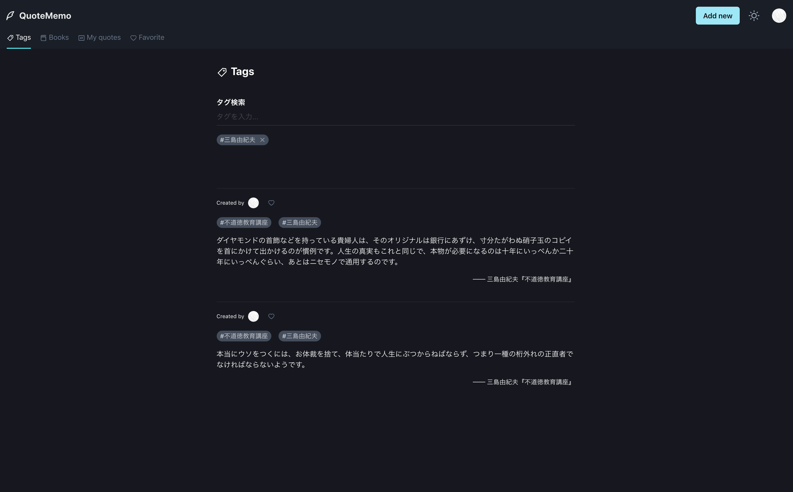

# QuoteMemo

## 概要

QuoteMemoは書籍の引用を管理・シェアできるWebサービスです。

## デモページ
[https://quote-memo-client.vercel.app](https://quote-memo-client.vercel.app)
（現在サーバー停止中）

## リポジトリ
フロントエンド: [https://github.com/shuheishintani/quote-memo-client](https://github.com/shuheishintani/quote-memo-client)

バックエンド: [https://github.com/shuheishintani/quote-memo-api](https://github.com/shuheishintani/quote-memo-api)

## 使用技術

バックエンド
  - Go v1.16
  - Gin v1.7.1
  - Gorm v1.21.9
  - PostgreSQL v13

フロントエンド
  - TypeScript v4.2.3
  - React v17.0.2
  - Next.js v10.2.2
  - Chakra UI (@chakra-ui/react v1.4.2)

認証
  - Firebase Authentication

開発環境
  - Docker/docker-compose

 CIツール
  - GitHub Actions

インフラ
  - Vercel
  - GCP(App Engine/Cloud SQL)

## システム構成図

## ER図

## 機能一覧
- Twitterログイン
- 外部APIを利用した書籍検索
- 引用の作成・更新・削除
- 追加履歴のある書籍を候補として表示する機能
- 公開設定
- タグ付け
- 複数のタグを指定して検索する機能
- 書籍に関連する引用一覧を表示する機能
- 他のユーザーが公開した引用一覧を表示する機能
- 他のユーザーが公開した引用をお気に入りに追加する機能
- 無限スクロール
- ダークモード
- 引用データをJSON形式でエクスポートする機能
- 退会処理
